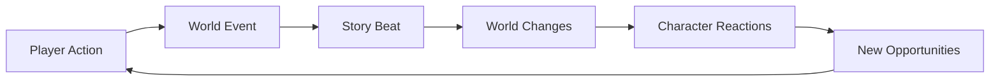

# 🌍 Story Engine

> **Transform static game worlds into living, breathing narratives that evolve with every player action.**

<p align="center">
  
  
  
  
  
</p>

<p align="center">
  <strong>🎮 <a href="#quick-start">Quick Start</a> • 
  🚀 <a href="#features">Features</a> • 
  📖 <a href="#the-golden-rule">Architecture</a> • 
  🛠️ <a href="#for-developers">For Developers</a> • 
  📚 <a href="./docs/">Full Docs</a></strong>
</p>

---

## 🎯 What is Story Engine?

Story Engine is an **event-driven narrative system** that creates dynamic, evolving stories for game worlds. Unlike traditional static narratives or branching storylines, Story Engine creates **living narratives** that adapt to player actions in real-time.

### 🌟 The Magic



**Every action creates ripples. Every ripple tells a story.**

## ✨ Features

### 🏰 **Automatic World Generation**
When you create a world, Story Engine automatically populates it with:
- **8-15 unique locations** (regions, cities, landmarks, wilderness)
- **2-3 rival factions** with competing ideologies
- **20-30 reactive characters** with personalities and motivations

### 📖 **Dynamic Story Arcs**
- 15-beat narrative structure based on Save the Cat
- Only 3 anchor points pre-generated for maximum flexibility
- Story beats adapt to player actions and world events
- Each arc transforms your world permanently

### 🔄 **The Golden Rule Architecture**
```
Every Action → Event → Beat → Reactions → More Events
```
This creates emergent narratives where:
- Assassinating a duke triggers a succession crisis
- Discovering ancient magic reshapes society
- Economic collapse leads to new alliances

### 🎭 **Reactive NPCs**
Characters aren't just stat blocks:
- Form memories of significant events
- Change motivations based on world state
- Take actions that create new story threads
- Die, flee, or rise to power based on circumstances

### 🗺️ **Living Locations**
Locations evolve through narrative states:
```
thriving → stable → declining → ruined → abandoned → lost
```
- Cities fall to plague or war
- Hidden locations are discovered
- Ruins become centers of new civilizations

### ⚔️ **Political Intrigue**
Factions provide dynamic conflict:
- Diplomatic stances shift based on events
- Ideologies evolve with changing fortunes
- Territory control affects power dynamics
- Alliances form and break naturally

## 🚀 Quick Start

### Prerequisites
- Node.js 18+
- PostgreSQL (via Supabase)
- OpenRouter API key

### 1. Clone & Install

```bash
git clone https://github.com/yourusername/story-engine.git
cd story-engine
npm install
```

### 2. Configure Environment

```bash
cp .env.example .env
```

Required variables:
```env
# API Keys
OPENROUTER_API_KEY=your_key_here
SUPABASE_URL=your_project_url
SUPABASE_ANON_KEY=your_anon_key

# Optional but recommended
OPENPIPE_API_KEY=for_ai_observability
```

### 3. Set Up Database

Run the migrations in your Supabase project:
```bash
# Copy migrations from supabase/migrations/* to your Supabase SQL editor
```

### 4. Launch the Engine

```bash
npm run dev:all
```

- 🎨 **Frontend**: http://localhost:5173
- 🔧 **API**: http://localhost:3001
- 🎮 **Playground**: http://localhost:3001/playground

## 🎮 Using Story Engine

### Creating Your First World

```typescript
// Via SDK
const world = await storyEngine.worlds.create({
  name: "The Shattered Realms",
  description: "A world where magic is dying and technology rises"
});

// Via REST API
POST /api/worlds
{
  "name": "The Shattered Realms",
  "description": "A world where magic is dying and technology rises"
}
```

This automatically generates:
- Major regions with distinct characteristics
- Cities, landmarks, and wilderness areas
- Competing factions with ideologies
- Characters with roles and motivations

### Recording Events (The Heart of the System)

```typescript
// A player action that will ripple through the world
await storyEngine.worlds.recordEvent(worldId, {
  event_type: "player_action",
  impact_level: "major",
  description: "The ancient seal on the Shadowgate has been broken"
});
```

### Progressing the Story

```typescript
// Generate the next story beat based on accumulated events
const nextBeat = await storyEngine.worlds.progressArc(arcId, { worldId });

// Returns something like:
{
  beat_name: "The Shadow Awakens",
  world_directives: [
    "Dark creatures begin emerging near the Shadowgate",
    "The Mage Guild mobilizes to investigate",
    "Common folk flee the northern territories"
  ],
  emergent_storylines: [
    "A cult devoted to the shadow forms",
    "Ancient prophecies surface about a chosen one"
  ]
}
```

## 📖 The Golden Rule

The entire system follows one simple rule that creates infinite complexity:

```
Every Action → Event → Beat → Reactions → More Events
```

### Example Flow

1. **Player Action**: "Assassinate the Duke of Westford"
2. **Event Logged**: `{ impact: "catastrophic", description: "Duke assassinated" }`
3. **Story Beat Generated**: "The Succession Crisis"
   - Directives: ["Nobles choose sides", "Trade routes disrupted"]
   - Emergent: ["Duke's bastard son appears", "Ancient law discovered"]
4. **Automatic Reactions**:
   - Factions split into rival camps
   - Characters form memories and change loyalties
   - Locations change status (castle → contested)
   - New events generated → cycle continues

## 🛠️ For Developers

### Architecture Highlights

- **Modular Design**: Each feature (worlds, characters, locations, factions) is a self-contained module
- **Event-Driven**: Modules communicate only through events, ensuring perfect decoupling
- **Type-Safe**: Full TypeScript with tRPC for end-to-end type safety
- **AI-Powered**: Each module has specialized AI agents for content generation
- **Dual API**: Automatic REST endpoints alongside tRPC for maximum compatibility

### Creating a New Module

```typescript
// 1. Define your domain with Zod
export const Dragon = z.object({
  id: UUIDString,
  world_id: UUIDString,
  name: NonEmptyString,
  lair_location_id: UUIDString,
  hoard_value: PositiveInt,
  temperament: z.enum(['hostile', 'neutral', 'friendly']),
  age: z.enum(['wyrmling', 'young', 'adult', 'ancient'])
});

// 2. Create your service
@injectable()
export class DragonService {
  async create(input: CreateDragon) {
    const dragon = await this.repo.create(input);
    eventBus.emit('dragon.awakened', { worldId: dragon.world_id });
    return dragon;
  }
}

// 3. Define tRPC router (auto-generates REST endpoints!)
export const dragonRouter = router({
  list: publicProcedure
    .input(z.object({ worldId: z.string() }))
    .query(({ input }) => dragonService().list(input.worldId)),
    
  create: authedProcedure
    .input(CreateDragon)
    .mutation(({ input }) => dragonService().create(input))
});
```

### Frontend Type Safety (Zero Duplication)

```typescript
// Types are automatically inferred from backend!
import type { RouterOutputs } from '@/lib/trpc';

type Dragon = RouterOutputs['dragon']['list'][number];
// Full type safety, no manual type definitions needed!
```

## 📊 Production Ready

- **Scalable**: Designed for horizontal scaling
- **Observable**: Built-in AI usage tracking and cost monitoring
- **Reliable**: Comprehensive error handling and retry logic
- **Performant**: Optimized queries and caching strategies
- **Secure**: API key authentication and row-level security

## 🌟 Why Story Engine?

### For Game Developers
- Stop writing static quest lines that players speedrun through
- Create worlds that surprise even you, the creator
- Let player actions have meaningful, lasting consequences
- Build narratives that emerge from gameplay, not scripts

### For Players
- Every playthrough is unique
- Actions have real consequences
- The world remembers and reacts
- Stories that feel alive and responsive

### For AI Enthusiasts
- See practical AI application beyond chatbots
- Multiple specialized agents working in harmony
- Structured generation with narrative coherence
- Open source implementation to learn from

## 📚 Documentation

- 📖 [System Overview](./docs/modules/worlds/system-overview.md) - Core concepts and philosophy
- 🎭 [Narrative Design](./docs/modules/worlds/narrative-design.md) - How stories evolve
- 🏗️ [Architecture](./docs/golden-rule-architecture.md) - The Golden Rule explained
- 🔧 [Module Creation](./docs/creating_modules.md) - Build your own features
- 🌐 [API Reference](./docs/sdk-api-reference.md) - Complete API documentation
- 🎮 [Frontend Guide](./docs/frontend_guide.md) - Building UIs with Story Engine

## 🤝 Contributing

We love contributions! Whether it's:
- 🐛 Bug fixes
- ✨ New features
- 📚 Documentation improvements
- 🎨 UI enhancements
- 🧪 Test coverage

Check out our [Contributing Guide](./docs/contributing.md) to get started.

## 📜 License

MIT - Build amazing narrative experiences!

---

<p align="center">
  <strong>Ready to create living worlds?</strong><br>
  <a href="#quick-start">Get Started</a> • 
  <a href="https://github.com/yourusername/story-engine/issues">Report Bug</a> • 
  <a href="https://github.com/yourusername/story-engine/discussions">Join Discussion</a>
</p>

<p align="center">
  <i>Built with ❤️ by a fucken D&D nerd</i>
</p>