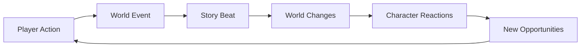

# 🌍 Story Engine

> **Transform static game worlds into living, breathing narratives that evolve with every player action.**

---

## 🎯 What is Story Engine?

Story Engine is an **event-driven narrative system** that creates dynamic, evolving stories for game worlds. Unlike traditional static narratives or branching storylines, Story Engine creates **living narratives** that adapt to player actions in real-time.

### 🌟 The Magic



**Every action creates ripples. Every ripple tells a story.**

## ✨ Features

### 🏰 **Automatic World Generation**
When you create a world, Story Engine automatically populates it with:
- **8-15 unique locations** (regions, cities, landmarks, wilderness)
- **2-3 rival factions** with competing ideologies
- **20-30 reactive characters** with personalities and motivations

### 📖 **Dynamic Story Arcs**
- 15-beat narrative structure based on the *Save the Cat* framework
- Only 3 anchor points are pre-generated for maximum flexibility
- Story beats adapt to player actions and world events
- Each arc transforms your world permanently

### 🔄 **The Golden Rule Architecture**
```
Every Action → Event → Beat → Reactions → More Events
```
This creates emergent narratives where:
- Assassinating a duke triggers a succession crisis
- Discovering ancient magic reshapes society
- Economic collapse leads to new alliances

### 🎭 **Reactive NPCs**
Characters aren't just stat blocks:
- Form memories of significant events
- Change motivations based on world state
- Take actions that create new story threads
- Die, flee, or rise to power based on circumstances

### 🗺️ **Living Locations**
Locations evolve through narrative states:
```
thriving → stable → declining → ruined → abandoned → lost
```
- Cities fall to plague or war
- Hidden locations are discovered
- Ruins become centers of new civilizations

### ⚔️ **Political Intrigue**
Factions provide dynamic conflict:
- Diplomatic stances shift based on events
- Ideologies evolve with changing fortunes
- Territory control affects power dynamics
- Alliances form and break naturally

## 🚀 Quick Start

### Prerequisites
- Node.js 18+
- PostgreSQL (via Supabase)
- OpenRouter API key

### 1. Clone & Install
```bash
git clone https://github.com/kingbootoshi/story-engine.git
cd story-engine
npm install
```

### 2. Configure Environment
Create a `.env` file by copying the example:
```bash
cp .env.example .env
```
Then, fill in your credentials. You can find these in your Supabase project settings and on OpenRouter.
```env
# API Keys
OPENROUTER_API_KEY=your_key_here
SUPABASE_URL=your_project_url
SUPABASE_ANON_KEY=your_anon_key

# Optional but recommended for AI observability
OPENPIPE_API_KEY=your_openpipe_key_here
```

### 3. Set Up Database
Go to your Supabase project's SQL Editor and run the migrations found in `supabase/migrations/*`.

### 4. Launch the Engine
```bash
npm run dev:all
```
- 🎨 **Frontend**: `http://localhost:5173`
- 🔧 **API**: `http://localhost:3001`
- 🎮 **Playground**: `http://localhost:3001/playground`

## 🎮 Using the Engine

### Creating Your First World
This single API call generates a complete world with locations, factions, and characters.

```typescript
// Via SDK (or any tRPC client)
const world = await storyEngine.worlds.create({
  name: "The Shattered Realms",
  description: "A world where magic is dying and technology rises"
});
```
```bash
# Via REST API
curl -X POST http://localhost:3001/api/worlds \
  -H "Content-Type: application/json" \
  -H "x-api-key: YOUR_API_KEY" \
  -d '{
    "name": "The Shattered Realms",
    "description": "A world where magic is dying and technology rises"
  }'
```

### Recording Events (The Heart of the System)
Record a player action that will ripple through the world.

```typescript
await storyEngine.worlds.recordEvent({
  world_id: world.id,
  event_type: "player_action",
  impact_level: "major",
  description: "The ancient seal on the Shadowgate has been broken by a hero."
});
```

### Progressing the Story
Generate the next story beat based on accumulated events.

```typescript
const nextBeat = await storyEngine.worlds.progressArc({
  arcId: world.current_arc_id,
  worldId: world.id
});

// Returns a rich object describing the world's evolution:
{
  beat_name: "The Shadow Awakens",
  description: "With the Shadowgate seal broken, a palpable darkness seeps from the gate...",
  world_directives: [
    "Dark creatures begin emerging near the Shadowgate.",
    "The Mage Guild mobilizes to investigate.",
    "Common folk flee the northern territories, creating a refugee crisis."
  ],
  emergent_storylines: [
    "A cult devoted to the shadow forms in the capital city.",
    "Ancient prophecies surface about a chosen one destined to face the darkness."
  ]
}
```

## 📖 The Golden Rule

The entire system follows one simple rule that creates infinite complexity:

```
Every Action → Event → Beat → Reactions → More Events
```

### Example Flow

1.  **Player Action**: "Assassinate the Duke of Westford"
2.  **Event Logged**: `{ impact: "major", description: "Duke assassinated" }`
3.  **Story Beat Generated**: "The Succession Crisis"
    -   *Directives*: ["Nobles choose sides", "Trade routes disrupted"]
    -   *Emergent*: ["Duke's bastard son appears", "Ancient law discovered"]
4.  **Automatic Reactions**:
    -   Factions split into rival camps.
    -   Characters form memories and change loyalties.
    -   Locations change status (e.g., castle → contested).
    -   New events are generated by NPCs, continuing the cycle.

## 🛠️ For Developers

### Architecture Highlights
-   **Modular Design**: Each feature (worlds, characters, factions) is a self-contained module in `src/modules`.
-   **Event-Driven**: Modules communicate only through an event bus, ensuring perfect decoupling.
-   **Type-Safe API**: Full end-to-end type safety with tRPC, from database to frontend.
-   **Dual API**: REST endpoints are **automatically generated** from your tRPC routers for maximum compatibility.
-   **AI-Powered**: Each module has specialized AI agents for intelligent content generation.

### Creating a New Module in Minutes

1.  **Define your domain** with Zod schemas (`src/modules/dragon/domain/schema.ts`):
    ```typescript
    export const Dragon = z.object({
      id: UUIDString,
      world_id: UUIDString,
      name: NonEmptyString,
      lair_location_id: UUIDString.nullable(),
      temperament: z.enum(['hostile', 'neutral', 'friendly']),
    });
    ```

2.  **Create your service** with dependency injection (`src/modules/dragon/application/DragonService.ts`):
    ```typescript
    @injectable()
    export class DragonService {
      constructor(
        @inject('IDragonRepository') private repo: IDragonRepository,
        @inject('EventBus') private eventBus: IEventBus
      ) {}

      async create(input: CreateDragon) {
        const dragon = await this.repo.create(input);
        this.eventBus.emit('dragon.awakened', { dragonId: dragon.id });
        return dragon;
      }
    }
    ```

3.  **Expose it via a tRPC router** (`src/modules/dragon/delivery/trpc/router.ts`):
    ```typescript
    export const dragonRouter = router({
      list: publicProcedure
        .input(z.object({ worldId: UUIDString }))
        .query(({ input }) => dragonService.listByWorld(input.worldId)),

      create: authedProcedure
        .input(CreateDragonSchema)
        .mutation(({ input, ctx }) => dragonService.create(input, ctx)),
    });
    ```
    Your REST endpoints (`GET /api/dragons?worldId=...` and `POST /api/dragons`) are now live!

4.  **Use it on the frontend with 100% type safety**:
    ```typescript
    // Types are automatically inferred from the backend!
    import { trpc, type AppRouter } from '@/shared/lib/trpcClient';

    type Dragon = AppRouter['dragon']['list']['_def']['_output_out'][number];

    function DragonComponent() {
      const { data: dragons } = trpc.dragon.list.useQuery({ worldId });
      // `dragons` is fully typed as `Dragon[] | undefined`
    }
    ```

## 📊 Production Ready

-   **Scalable**: Designed for horizontal scaling with a stateless architecture.
-   **Observable**: Built-in AI usage tracking, cost monitoring, and structured logging.
-   **Reliable**: Comprehensive error handling and automatic retry logic for AI calls.
-   **Performant**: Optimized queries and caching strategies via React Query.
-   **Secure**: API key authentication and row-level security in Supabase.

## 🌟 Why Story Engine?

| For Game Developers                                          | For Players                                          | For AI Enthusiasts                                     |
| ------------------------------------------------------------ | ---------------------------------------------------- | ------------------------------------------------------ |
| Stop writing static quest lines that players speedrun through. | Every playthrough is unique.                         | See practical AI application beyond chatbots.          |
| Create worlds that surprise even you, the creator.           | Actions have real, lasting consequences.             | Witness multiple specialized agents working in harmony. |
| Let player actions have meaningful, permanent consequences.  | The world remembers and reacts.                      | Explore structured generation with narrative coherence. |
| Build narratives that emerge from gameplay, not scripts.     | Stories feel alive and responsive.                   | Learn from an open-source, modular AI implementation. |

## 📚 Documentation

-   📖 **[System Overview](./docs/system-overview.md)** - Core concepts and philosophy.
-   🎭 **[Narrative Design](./docs/narrative-design.md)** - How stories evolve.
-   🏗️ **[Architecture](./docs/architecture.md)** - The Golden Rule explained.
-   🔧 **[Module Creation](./docs/creating-modules.md)** - Build your own features.
-   🌐 **[API Reference](./docs/api-reference.md)** - Complete API documentation.
-   🎮 **[Frontend Guide](./docs/frontend-guide.md)** - Building UIs with Story Engine.

## 📜 License

This project is licensed under the **MIT License**.

---

<p align="center">
  <strong>Ready to create living worlds?</strong><br>
  <a href="#-quick-start">Get Started</a> • 
  <a href="https://github.com/yourusername/story-engine/issues">Report a Bug</a> • 
  <a href="https://github.com/yourusername/story-engine/discussions">Join the Discussion</a>
</p>

<p align="center">
  <i>Built with ❤️ by a fucken D&D nerd</i>
</p>
```