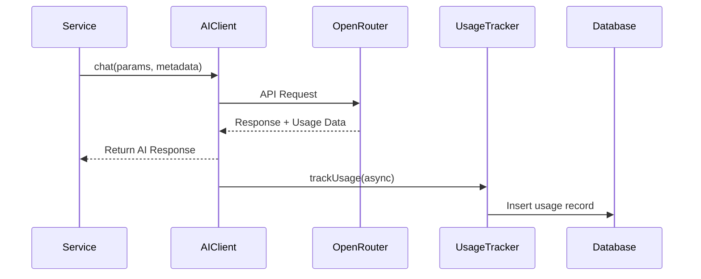

# AI Usage Tracking Documentation

## Overview

Story Engine automatically tracks all AI model usage for billing, analytics, and cost management. Every AI call made through the system is recorded with detailed token counts, costs, and contextual metadata.

## Architecture

### Components

1. **Database Schema** (`user_ai_usage` table)
   - Stores individual AI usage records per user
   - Tracks tokens, costs, and metadata for each call
   - Enables aggregation by user, model, module, and time period

2. **Usage Tracker Service** (`src/core/ai/usage-tracker.ts`)
   - Asynchronously records usage after each AI call
   - Extracts token counts from OpenRouter responses
   - Estimates costs based on model pricing
   - Non-blocking to avoid impacting AI generation performance

3. **AI Client Integration** (`src/core/ai/client.ts`)
   - Automatically captures usage data from every AI call
   - Fires tracking in background without blocking responses
   - Handles failures gracefully with error logging

4. **Usage API Module** (`src/modules/usage/`)
   - Provides tRPC endpoints for querying usage data
   - Supports aggregation by period, model, and module
   - Enables per-world usage tracking

## How It Works

### 1. Metadata Requirement

Every AI call must include user_id in its metadata:

```typescript
const metadata = buildMetadata(
  'world',                    // module name
  'generate_world_arc@v1',    // prompt identifier
  userId,                     // user's Supabase UUID (required)
  { world_id: worldId }       // additional metadata
);
```

### 2. Automatic Tracking Flow



### 3. Cost Calculation

Costs are estimated based on model pricing (per 1M tokens):

```typescript
const pricing = {
  'openai/gpt-4o': { prompt: 5.0, completion: 15.0 },
  'openai/gpt-4o-mini': { prompt: 0.15, completion: 0.6 },
  'openai/gpt-4.1-nano': { prompt: 0.1, completion: 0.4 },
  'anthropic/claude-sonnet-4': { prompt: 3.0, completion: 15.0 }
};
```

## Database Schema

```sql
CREATE TABLE user_ai_usage (
  id UUID PRIMARY KEY,
  user_id UUID NOT NULL,              -- Supabase auth user
  generation_id TEXT,                 -- OpenRouter generation ID
  model VARCHAR(255) NOT NULL,        -- Model used
  prompt_tokens INTEGER NOT NULL,     -- Input tokens
  completion_tokens INTEGER NOT NULL, -- Output tokens  
  total_tokens INTEGER NOT NULL,      -- Total tokens
  total_cost DECIMAL(10, 6) NOT NULL,-- USD cost
  module VARCHAR(100) NOT NULL,       -- e.g., 'world', 'faction'
  prompt_id VARCHAR(100) NOT NULL,    -- e.g., 'generate_world_arc@v1'
  world_id UUID,                      -- Optional world context
  metadata JSONB DEFAULT '{}',        -- Additional data
  created_at TIMESTAMPTZ DEFAULT NOW()
);
```

## API Endpoints

### Get Usage Records

```typescript
// Get recent usage records
const records = await trpc.usage.getRecords.query({
  startDate: '2024-01-01T00:00:00Z',
  endDate: '2024-12-31T23:59:59Z',
  limit: 100
});
```

### Get Usage Summary

```typescript
// Get monthly summary
const summary = await trpc.usage.getSummary.query({
  period: 'month' // 'day' | 'week' | 'month' | 'all'
});

// Response includes:
{
  total_tokens: 150000,
  total_cost: 2.50,
  usage_by_model: {
    'openai/gpt-4o': { tokens: 100000, cost: 2.00 },
    'openai/gpt-4o-mini': { tokens: 50000, cost: 0.50 }
  },
  usage_by_module: {
    'world': { tokens: 80000, cost: 1.60 },
    'character': { tokens: 70000, cost: 0.90 }
  }
}
```

### Get Current Month Usage

```typescript
// For billing purposes
const billing = await trpc.usage.getCurrentMonth.query();
// Returns: { tokens, cost, daily_average }
```

### Get World-Specific Usage

```typescript
// Track costs per world
const worldUsage = await trpc.usage.getWorldUsage.query({
  worldId: 'uuid-here',
  startDate: '2024-01-01T00:00:00Z'
});
```

## Implementation Guide

### For Authenticated Procedures

When you have access to tRPC context:

```typescript
class MyService {
  async generateContent(ctx: TrpcCtx, params: any) {
    const result = await this.ai.generate({
      ...params,
      metadata: buildMetadata(
        'mymodule',
        'generate_content@v1',
        ctx.user.id,  // From tRPC context
        { extra: 'data' }
      )
    });
  }
}
```

### For Event Handlers

When handling events without user context:

```typescript
async handleWorldEvent(event: WorldCreatedEvent) {
  // Fetch world to get owner's user_id
  const world = await this.worldRepo.getWorld(event.worldId);
  const userId = world?.user_id || 'anonymous';
  
  const result = await this.ai.generate({
    ...params,
    metadata: buildMetadata(
      'mymodule',
      'handle_event@v1',
      userId,
      { world_id: event.worldId }
    )
  });
}
```

### For Background Jobs

For system-initiated AI calls:

```typescript
async runScheduledJob() {
  // Use system user or specific job user
  const systemUserId = process.env.SYSTEM_USER_ID || 'system';
  
  const result = await this.ai.generate({
    ...params,
    metadata: buildMetadata(
      'jobs',
      'scheduled_task@v1',
      systemUserId,
      { job_type: 'scheduled' }
    )
  });
}
```

## Usage Analytics

### Track by Module

Understand which features consume the most tokens:

```sql
SELECT 
  module,
  SUM(total_tokens) as tokens,
  SUM(total_cost) as cost,
  COUNT(*) as calls
FROM user_ai_usage
WHERE user_id = ?
  AND created_at >= NOW() - INTERVAL '30 days'
GROUP BY module
ORDER BY cost DESC;
```

### Track by Prompt

Identify expensive operations:

```sql
SELECT 
  prompt_id,
  AVG(total_tokens) as avg_tokens,
  AVG(total_cost) as avg_cost,
  COUNT(*) as usage_count
FROM user_ai_usage
WHERE module = 'world'
GROUP BY prompt_id
ORDER BY avg_cost DESC;
```

### User Spending Trends

Monitor user costs over time:

```sql
SELECT 
  DATE_TRUNC('day', created_at) as day,
  SUM(total_cost) as daily_cost
FROM user_ai_usage
WHERE user_id = ?
  AND created_at >= NOW() - INTERVAL '7 days'
GROUP BY day
ORDER BY day;
```

## Best Practices

### 1. Always Include User Context

```typescript
// ❌ Bad - missing user_id
buildMetadata('world', 'generate@v1', { world_id: id })

// ✅ Good - includes user_id
buildMetadata('world', 'generate@v1', userId, { world_id: id })
```

### 2. Use Descriptive Prompt IDs

```typescript
// ❌ Bad - vague identifier
buildMetadata('faction', 'ai_call', userId)

// ✅ Good - specific and versioned
buildMetadata('faction', 'generate_propaganda@v1', userId)
```

### 3. Handle Anonymous Users

```typescript
// For public endpoints or unknown users
const userId = ctx.user?.id || 'anonymous';
```

### 4. Include Relevant Metadata

```typescript
// Include context for better analytics
buildMetadata('character', 'evaluate_reaction@v1', userId, {
  world_id: worldId,
  character_id: characterId,
  beat_index: beatIndex,
  correlation: ctx.reqId
})
```

## Monitoring & Alerts

### High Usage Detection

Monitor for unusual usage patterns:

```typescript
// Check if user exceeds daily limit
const today = await usageService.getUsageRecords(
  userId,
  new Date().setHours(0, 0, 0, 0),
  new Date()
);

const dailyCost = today.reduce((sum, r) => sum + r.total_cost, 0);
if (dailyCost > DAILY_LIMIT) {
  // Alert or throttle
}
```

### Cost Optimization

Identify optimization opportunities:

1. **Model Selection**: Use cheaper models for simple tasks
2. **Prompt Engineering**: Reduce token usage with concise prompts
3. **Caching**: Cache responses for repeated queries
4. **Batching**: Combine multiple small requests

## Troubleshooting

### Missing Usage Records

If usage isn't being tracked:

1. Check that user_id is included in metadata
2. Verify Supabase connection is working
3. Check logs for tracking errors
4. Ensure RLS policies allow inserts

### Incorrect Costs

If costs seem wrong:

1. Verify model pricing in `estimateCost()`
2. Check if using native vs normalized tokens
3. Consider using OpenRouter's generation endpoint for exact costs

### Performance Impact

If tracking affects performance:

1. Ensure tracking is async (fire-and-forget)
2. Check database connection pooling
3. Consider batching inserts
4. Monitor Supabase performance

## Future Enhancements

1. **Real-time Cost Alerts**: Notify users approaching limits
2. **Budget Management**: Set and enforce spending limits
3. **Cost Attribution**: Track costs by feature or action
4. **Usage Predictions**: Forecast monthly costs
5. **Optimization Suggestions**: Recommend cheaper alternatives
6. **Detailed Analytics Dashboard**: Visualize usage patterns