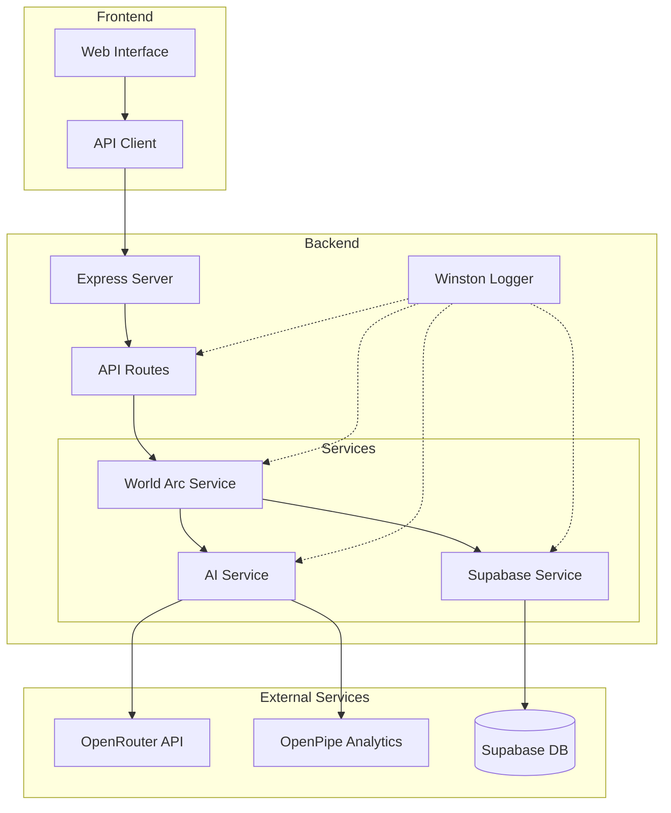

# System Architecture

This document describes the technical architecture of the World Story Engine.

## High-Level Architecture



## Component Details

### Frontend Layer

#### Web Interface (`app.ts`)
- Single-page application built with TypeScript
- Vanilla JS for minimal dependencies
- Real-time updates via polling (WebSocket planned)
- Responsive design with CSS Grid/Flexbox

#### API Client (`api.ts`)
- Typed interfaces for all API responses
- Error handling and retry logic
- Request/response interceptors
- Local state management

### Backend Layer

#### Express Server (`server.ts`)
- RESTful API design
- CORS enabled for cross-origin requests
- Request logging middleware
- Global error handling
- Health check endpoint

#### API Routes (`world.routes.ts`)
- Resource-based routing
- Input validation
- Response formatting
- Error propagation

### Service Layer

#### World Arc Service (`worldArc.service.ts`)
The orchestration layer that coordinates narrative generation.

```typescript
class WorldArcService {
  // Core narrative operations
  createNewArc()      // Initialize new story arc
  progressArc()       // Generate next beat
  completeArc()       // Finalize and summarize
  
  // State management
  getWorldState()     // Current narrative state
  recordWorldEvent()  // Log player actions
  
  // Utility functions
  getPreviousArcSummaries()
  generateArcSummary()
}
```

#### AI Service (`ai.service.ts`)
Handles all AI interactions with guaranteed structured output.

```typescript
class AIService {
  // Narrative generation with function calling
  generateWorldArcAnchors()    // Create 3 anchor points
  generateDynamicWorldBeat()   // Create contextual beat
  generateArcSummary()         // Summarize completed arc
  
  // OpenRouter integration
  - Function calling for structured output
  - Automatic retry with exponential backoff
  - Token usage tracking
  - Error handling and logging
}
```

**Function Calling Architecture:**
```typescript
// Example schema structure
const SCHEMA = {
  type: "function",
  function: {
    name: "function_name",
    parameters: {
      type: "object",
      properties: { /* structured fields */ },
      required: [/* required fields */],
      additionalProperties: false
    },
    strict: true  // Ensures compliance
  }
}
```

#### Supabase Service (`supabase.service.ts`)
Database abstraction layer with type safety.

```typescript
class SupabaseService {
  // World management
  createWorld()
  getWorld()
  updateWorld()
  
  // Arc management
  createArc()
  getArc()
  getWorldArcs()
  completeArc()
  
  // Beat management
  createBeat()
  getArcBeats()
  getLatestBeat()
  
  // Event tracking
  createEvent()
  getRecentEvents()
  getEventsSinceDate()
}
```

### Data Layer

#### Database Schema

```sql
-- Core entities
worlds           -- Game universes
world_arcs       -- 15-beat story structures  
world_beats      -- Individual story moments
world_events     -- Player actions and system events

-- Relationships
worlds 1:N world_arcs
world_arcs 1:N world_beats
worlds 1:N world_events
world_arcs 1:N world_events (optional)
world_beats 1:N world_events (optional)
```

#### Data Flow

1. **Arc Creation Flow**
   ```
   Client Request → API Route → World Arc Service → AI Service
   ↓
   Generate 3 Anchors → Save to DB → Return to Client
   ```

2. **Beat Progression Flow**
   ```
   Client Request → API Route → World Arc Service
   ↓
   Fetch Previous Beats → Get Recent Events → AI Generation
   ↓
   Save Beat → Record System Event → Return to Client
   ```

3. **Event Recording Flow**
   ```
   Client Event → API Route → Supabase Service
   ↓
   Validate → Store → Available for Next Beat
   ```

### External Integrations

#### OpenRouter
- Provides access to multiple AI models
- Handles model routing and fallbacks
- Usage-based pricing
- Built-in rate limiting

#### OpenPipe (Optional)
- Observability for AI calls
- Token usage analytics
- Performance monitoring
- Cost tracking

#### Supabase
- PostgreSQL database
- Real-time subscriptions (future)
- Row-level security (future)
- Built-in auth (future)

## Logging Architecture

### Winston Logger Configuration

```typescript
// Log Levels
error: 0   // System errors
warn: 1    // Warning conditions  
info: 2    // General information
http: 3    // HTTP requests
debug: 4   // Detailed debugging

// Log Outputs
Console     // Colored, formatted output
error.log   // Error-level only
all.log     // Complete logs in JSON
```

### Logging Strategy

1. **Module-Specific Loggers**: Each service gets its own logger instance
2. **Structured Logging**: JSON format for parsing and analysis
3. **Contextual Information**: Request IDs, user context, operation details
4. **Performance Metrics**: Operation duration, token usage, DB query time

## Security Architecture

### API Security
- Environment variable configuration
- CORS restrictions
- Input validation and sanitization
- SQL injection prevention via parameterized queries

### Future Security Enhancements
- JWT authentication
- Rate limiting per user
- API key management
- Webhook signature verification

## Performance Considerations

### Caching Strategy
- 15-minute cache for AI responses
- Database connection pooling
- Static asset caching headers
- CDN integration (future)

### Scalability Design
- Stateless API design
- Horizontal scaling ready
- Database indexing on key fields
- Asynchronous beat generation

### Optimization Techniques
- Sparse anchor generation (3 vs 15 beats)
- Lazy loading of historical data
- Batch database operations
- Efficient event aggregation

## Error Handling

### Error Classification
1. **Client Errors (4xx)**: Invalid input, not found
2. **Server Errors (5xx)**: System failures
3. **External Service Errors**: AI/DB timeouts
4. **Business Logic Errors**: Invalid state transitions

### Error Propagation
```
Service Layer → Throws typed errors
     ↓
Route Handler → Catches and formats
     ↓
Error Middleware → Logs and responds
     ↓
Client → Receives structured error
```

## Future Architecture Considerations

### Planned Enhancements
1. **WebSocket Support**: Real-time beat updates
2. **Message Queue**: Async beat generation
3. **Caching Layer**: Redis for performance
4. **CDN Integration**: Static asset delivery
5. **Microservices**: Service separation

### Scaling Strategy
1. **Vertical**: Increase server resources
2. **Horizontal**: Load balancer + multiple instances
3. **Database**: Read replicas, partitioning
4. **AI Service**: Request queuing, model caching

### Monitoring & Observability
1. **APM Integration**: DataDog/New Relic
2. **Log Aggregation**: ELK Stack
3. **Error Tracking**: Sentry
4. **Uptime Monitoring**: Pingdom
5. **Custom Dashboards**: Grafana

## Development Workflow

### Local Development
```
Frontend (Vite) → localhost:5173
Backend (Express) → localhost:3001
Database (Supabase) → Cloud/Local
```

### CI/CD Pipeline
```
Git Push → GitHub Actions → Tests → Build → Deploy
```

### Environment Management
- Development: Local with debug logging
- Staging: Production-like with test data
- Production: Optimized with monitoring