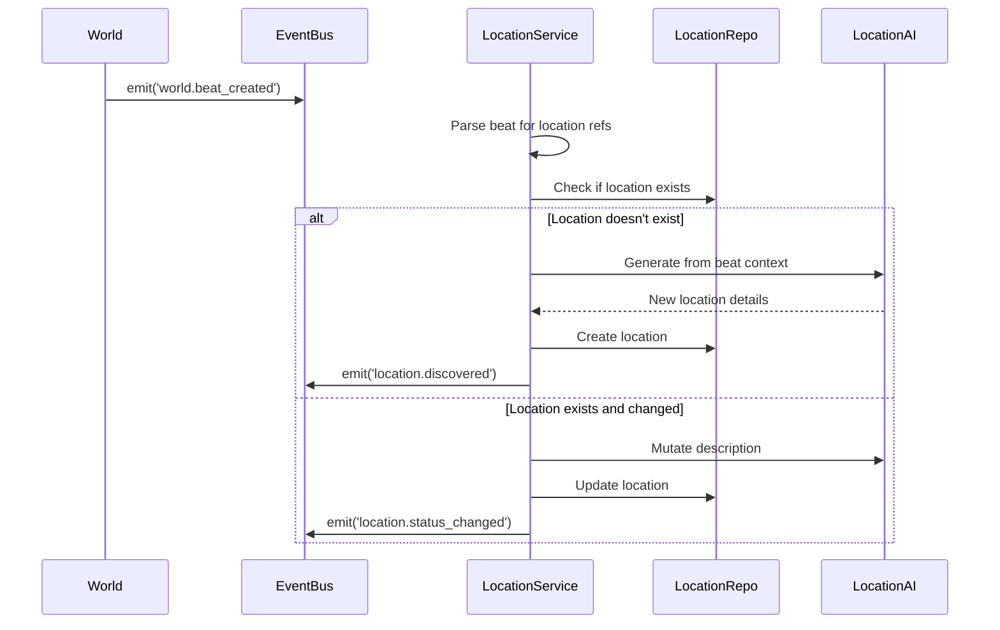
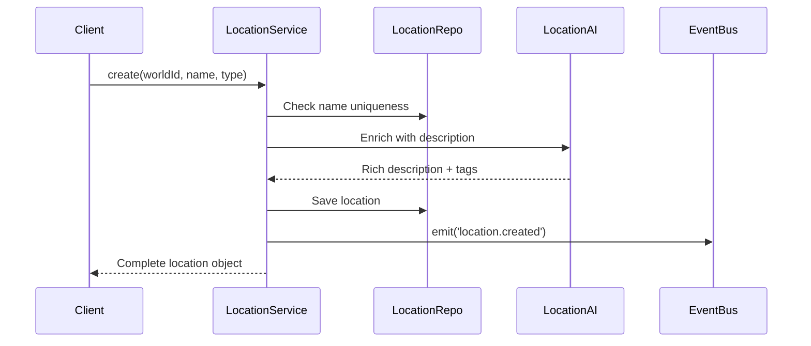

# Location Module Design Document

## Executive Summary

The Location Module provides persistent spatial entities within Story Engine worlds, enabling consistent narrative generation while allowing dynamic changes based on world events. Locations represent world-map-scale places (regions, cities, landmarks, wilderness) that serve as concrete settings for stories and can be transformed by player actions and system events.

## Core Principles

1. **World Map Scale**: Only track locations significant enough to appear on a world map
2. **Historical Preservation**: Never delete locations; track state changes over time
3. **Faction Ready**: Prepare for future political dynamics with faction control
4. **AI Flexibility**: Allow 70/30 split between using existing vs creating new locations
5. **Event Driven**: Location states cascade from world events automatically

## Domain Model

### Location Entity

```typescript
export const Location = z.object({
  // Identity
  id: z.string().uuid(),
  world_id: z.string().uuid(),
  parent_location_id: z.string().uuid().nullable(), // For hierarchical relationships
  
  // Core Attributes
  name: z.string().min(2).max(120),
  type: z.enum(['region', 'city', 'landmark', 'wilderness']),
  description: z.string(), // Markdown, AI-generated, rich sensory details
  
  // State Management
  status: z.enum(['thriving', 'stable', 'declining', 'ruined', 'abandoned', 'lost']),
  controlling_faction_id: z.string().uuid().nullable(),
  
  // Semantic Metadata
  tags: z.array(z.string()), // ['port', 'trade-hub', 'fortress', 'sacred', 'cursed']
  
  // History Tracking
  historical_names: z.array(z.string()).default([]),
  historical_events: z.array(z.object({
    timestamp: z.string().datetime(),
    event: z.string(),
    previous_status: z.enum(['thriving', 'stable', 'declining', 'ruined', 'abandoned', 'lost']),
    arc_id: z.string().uuid().nullable(),
    beat_index: z.number().nullable()
  })).default([]),
  
  // Timestamps
  created_at: z.string().datetime(),
  updated_at: z.string().datetime().optional(),
  last_significant_change: z.string().datetime().nullable(),
  
  // Extensibility
  metadata: z.record(z.any()).default({})
});
```

### State Transitions

```
thriving → stable → declining → ruined → abandoned → lost
         ↘         ↗         ↘       ↗
           declining            ruined
```

Each transition triggers events and potential description regeneration.

## Module Architecture

```
modules/location/
├── domain/
│   ├── schema.ts          # Zod schemas and types
│   ├── ports.ts           # Repository and AI interfaces
│   └── events.ts          # Domain event definitions
├── application/
│   └── LocationService.ts # Business logic orchestration
├── infra/
│   ├── persistence/
│   │   └── SupabaseLocationRepo.ts
│   ├── ai/
│   │   ├── prompts/
│   │   │   ├── enrich.prompts.ts
│   │   │   ├── mutate.prompts.ts
│   │   │   └── discover.prompts.ts
│   │   └── LocationAIAdapter.ts
│   └── index.ts           # DI registration
├── delivery/
│   └── trpc/router.ts     # API endpoints
└── manifest.ts            # Module registration
```

## Core Services

### LocationService Methods

```typescript
interface LocationService {
  // CRUD Operations
  create(input: CreateLocation, enrichWithAI?: boolean): Promise<Location>;
  update(input: UpdateLocation): Promise<Location>;
  get(id: string): Promise<Location | null>;
  getByWorld(worldId: string): Promise<Location[]>;
  
  // Hierarchical Operations
  getRegions(worldId: string): Promise<Location[]>;
  getLocationsInRegion(regionId: string): Promise<Location[]>;
  
  // Search & Discovery
  search(worldId: string, query: string): Promise<Location[]>;
  findByTags(worldId: string, tags: string[]): Promise<Location[]>;
  
  // State Management
  updateStatus(id: string, newStatus: LocationStatus, event: string): Promise<Location>;
  transferControl(id: string, factionId: string | null): Promise<Location>;
  
  // History
  getHistory(id: string, limit?: number): Promise<LocationHistoryEntry[]>;
  getLocationAtTime(id: string, timestamp: string): Promise<Location>;
  
  // AI Integration
  createFromBeat(worldId: string, beatDescription: string): Promise<Location>;
  enrichDescription(id: string): Promise<Location>;
}
```

## AI Integration

### Prompt Strategy

**Location Enrichment Prompt:**
```
ROLE: World cartographer and lorekeeper
CONTEXT: <world_description> and <existing_locations>
TASK: Enrich this location with vivid, actionable details

PRINCIPLES:
1. Honor existing world canon
2. Add sensory details (sights, sounds, smells)
3. Include practical information (size, resources, defenses)
4. Reference relationships to other locations
5. Leave room for future changes
```

**State Mutation Prompt:**
```
ROLE: Chronicle keeper tracking world changes
CONTEXT: <location_previous_state> and <triggering_event>
TASK: Describe how this location has transformed

REQUIREMENTS:
1. Show visible changes from the event
2. Maintain historical continuity
3. Create hooks for future stories
4. Update practical details (population, defenses)
```

### AI Schemas

```typescript
// Location enrichment
const ENRICH_LOCATION_SCHEMA = {
  type: "function",
  function: {
    name: "enrich_location",
    parameters: {
      description: { type: "string" },
      tags: { type: "array", items: { type: "string" } },
      suggestedMetadata: { type: "object" }
    }
  }
};

// Location discovery from beat
const DISCOVER_LOCATION_SCHEMA = {
  type: "function", 
  function: {
    name: "discover_location",
    parameters: {
      name: { type: "string" },
      type: { type: "string", enum: ["region", "city", "landmark", "wilderness"] },
      description: { type: "string" },
      tags: { type: "array", items: { type: "string" } },
      parentRegion: { type: "string", nullable: true }
    }
  }
};
```

## Event System

### Emitted Events

```typescript
// Location state changes
interface LocationCreatedEvent {
  worldId: string;
  locationId: string;
  name: string;
  type: 'region' | 'city' | 'landmark' | 'wilderness';
  discoveredInBeat?: { arcId: string; beatIndex: number };
}

interface LocationStatusChangedEvent {
  worldId: string;
  locationId: string;
  previousStatus: LocationStatus;
  newStatus: LocationStatus;
  reason: string;
  timestamp: string;
}

interface LocationControlChangedEvent {
  worldId: string;
  locationId: string;
  previousController: string | null;
  newController: string | null;
  method: 'conquest' | 'abandonment' | 'treaty' | 'uprising';
}
```

### Subscribed Events

```typescript
// From World module
'world.beat_created' → Parse for location references/changes
'world.event_logged' → Check for location impacts
'world.arc_completed' → Update location historical records

// Future: From Faction module  
'faction.conquered' → Update location control
'faction.disbanded' → Clear faction control
```

## API Endpoints

### tRPC Procedures

```typescript
const locationRouter = router({
  // Queries
  list: publicProcedure
    .input(z.object({ worldId: z.string().uuid() }))
    .query(/* list all locations in world */),
    
  get: publicProcedure
    .input(z.string().uuid())
    .query(/* get single location */),
    
  getRegions: publicProcedure
    .input(z.object({ worldId: z.string().uuid() }))
    .query(/* get all regions */),
    
  getInRegion: publicProcedure
    .input(z.object({ regionId: z.string().uuid() }))
    .query(/* get locations within region */),
    
  search: publicProcedure
    .input(z.object({ 
      worldId: z.string().uuid(), 
      query: z.string(),
      tags: z.array(z.string()).optional()
    }))
    .query(/* search by name/tags */),
    
  getHistory: publicProcedure
    .input(z.object({
      locationId: z.string().uuid(),
      limit: z.number().optional()
    }))
    .query(/* get location history */),
    
  // Mutations
  create: publicProcedure
    .input(CreateLocation)
    .mutation(/* create new location */),
    
  update: publicProcedure
    .input(UpdateLocation)
    .mutation(/* update location */),
    
  updateStatus: publicProcedure
    .input(z.object({
      locationId: z.string().uuid(),
      status: LocationStatus,
      reason: z.string()
    }))
    .mutation(/* change location status */),
    
  enrichWithAI: publicProcedure
    .input(z.string().uuid())
    .mutation(/* regenerate description with AI */)
});
```

### REST Endpoints (Auto-generated)

```
GET    /api/locations?worldId={uuid}         → list all locations
GET    /api/locations/{id}                   → get location
GET    /api/locations/regions?worldId={uuid} → get regions
GET    /api/locations/search?worldId={uuid}&q={string}&tags={csv}
GET    /api/locations/{id}/history?limit={n}
POST   /api/locations                        → create location
PUT    /api/locations/{id}                   → update location
PUT    /api/locations/{id}/status            → change status
POST   /api/locations/{id}/enrich            → AI enrichment
```

## Integration Flows

### 1. World Beat References Location



### 2. Manual Location Creation



## Database Schema

```sql
CREATE TABLE locations (
  id UUID DEFAULT uuid_generate_v4() PRIMARY KEY,
  world_id UUID NOT NULL REFERENCES worlds(id) ON DELETE CASCADE,
  parent_location_id UUID REFERENCES locations(id) ON DELETE SET NULL,
  
  -- Core fields
  name VARCHAR(120) NOT NULL,
  type VARCHAR(20) NOT NULL CHECK (type IN ('region','city','landmark','wilderness')),
  description TEXT NOT NULL,
  status VARCHAR(20) NOT NULL DEFAULT 'stable' 
    CHECK (status IN ('thriving','stable','declining','ruined','abandoned','lost')),
  
  -- Faction support
  controlling_faction_id UUID,
  
  -- Metadata
  tags TEXT[] DEFAULT '{}',
  historical_names TEXT[] DEFAULT '{}',
  historical_events JSONB DEFAULT '[]',
  metadata JSONB DEFAULT '{}',
  
  -- Timestamps
  created_at TIMESTAMPTZ DEFAULT NOW(),
  updated_at TIMESTAMPTZ DEFAULT NOW(),
  last_significant_change TIMESTAMPTZ,
  
  -- Constraints
  UNIQUE(world_id, name)
);

-- Indexes
CREATE INDEX idx_locations_world_id ON locations(world_id);
CREATE INDEX idx_locations_parent_id ON locations(parent_location_id);
CREATE INDEX idx_locations_type ON locations(type);
CREATE INDEX idx_locations_status ON locations(status);
CREATE INDEX idx_locations_faction ON locations(controlling_faction_id);
CREATE INDEX idx_locations_tags ON locations USING GIN(tags);
CREATE INDEX idx_locations_name_search ON locations USING gin(name gin_trgm_ops);
```

## Usage Examples

### Creating a Region with Cities

```typescript
// Create region
const northernWastes = await locationService.create({
  world_id: worldId,
  name: "The Northern Wastes",
  type: "region",
  description: "Frozen tundra rich in iron and ancient mysteries",
  tags: ["frozen", "hostile", "resource-rich", "mysterious"]
});

// Create city within region
const ironhold = await locationService.create({
  world_id: worldId,
  parent_location_id: northernWastes.id,
  name: "Ironhold",
  type: "city",
  description: "Dwarven fortress-city built into the Frostfang Mountains",
  tags: ["fortress-city", "dwarven", "mining", "well-defended"]
});
```

### Location State Change from Event

```typescript
// World event: "Dragon attack devastates Ironhold"
await locationService.updateStatus(
  ironhold.id,
  'ruined',
  'Devastated by dragon attack in the Battle of Frozen Flames'
);

// This triggers:
// 1. AI regenerates description showing destruction
// 2. Historical event logged
// 3. Event emitted for other modules
// 4. Future beats incorporate the ruins
```

### AI Location Discovery

```typescript
// Beat text: "...revealing the lost elven city of Mor'theraan..."
const discovered = await locationService.createFromBeat(
  worldId,
  beatDescription
);
// AI extracts location details and creates with appropriate tags
```

## Implementation Roadmap

### Phase 1: Core Module (Week 1)
- [ ] Database schema and migrations
- [ ] Domain models and events
- [ ] Basic CRUD operations
- [ ] Repository implementation

### Phase 2: AI Integration (Week 2)
- [ ] Location enrichment prompts
- [ ] State mutation prompts
- [ ] Beat parsing for locations
- [ ] AI adapter implementation

### Phase 3: Advanced Features (Week 3)
- [ ] Historical tracking system
- [ ] Hierarchical queries
- [ ] Search functionality
- [ ] Event subscriptions

### Phase 4: Testing & Polish (Week 4)
- [ ] Unit tests (>90% coverage)
- [ ] Integration tests
- [ ] Documentation
- [ ] Performance optimization

## Success Metrics

1. **Consistency**: 95% of beats reference existing locations
2. **Richness**: Average description length >200 words
3. **Performance**: Location queries <50ms
4. **Coverage**: >90% test coverage
5. **Integration**: Zero cross-module dependencies

## Future Enhancements

1. **Visual Mapping**: Export location data for map generation
2. **Climate System**: Seasonal changes affect descriptions
3. **Trade Routes**: Connections between locations
4. **Population Dynamics**: Rough population tracking in metadata
5. **Cultural Regions**: Grouping locations by culture/language

---

This design provides a solid foundation for the Location module that integrates seamlessly with Story Engine while preparing for future expansions like factions and character modules.