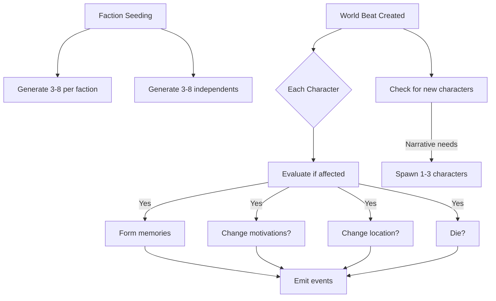

# Character Module

The Character module brings life to story worlds through individual agents with personalities, memories, and evolving motivations. Characters react to world events, form personal narratives, and create the human stories that make worlds feel real.

## Documentation

- [Narrative Design](./narrative-design.md) - Understanding characters as reactive agents
- [API Reference](./api-reference.md) - Complete endpoint documentation

## Quick Start

Characters are automatically generated when a world's factions are seeded. They then react individually to each story beat, forming memories and potentially changing their goals, locations, or even allegiances.

### Key Concepts

1. **No Relationship Matrix**: Characters don't track individual relationships. Instead, they understand social dynamics through faction memberships and political stances.

2. **Memory-Driven Evolution**: Characters change through accumulated memories, not stat modifications. Important events leave lasting impressions that shape future reactions.

3. **Individual Agency**: Each character evaluates beats independently, creating diverse reactions to the same events based on personality and circumstances.

4. **Batch Processing**: Characters react in groups of 10 to maintain performance while preserving individual responses.

### Example Character

```json
{
  "name": "Elena the Healer",
  "type": "npc",
  "status": "alive",
  "story_role": "minor",
  "location_id": "temple-district-uuid",
  "faction_id": "healers-guild-uuid",
  "description": "A young woman with gentle eyes and calloused hands from years of healing work",
  "background": "Orphaned by plague as a child, Elena dedicated her life to preventing others from suffering the same loss",
  "personality_traits": ["compassionate", "brave", "dedicated", "selfless"],
  "motivations": ["heal the sick", "protect the innocent", "find a cure for the plague"],
  "memories": [
    {
      "event_description": "Saved dozens from the market fire",
      "timestamp": "2024-01-15T10:45:00Z",
      "emotional_impact": "positive",
      "importance": 0.9,
      "beat_index": 7
    }
  ]
}
```

### Character Lifecycle



## Integration Points

### With Factions
- Characters can belong to factions (or remain independent)
- Faction relationships provide political context
- Faction events may trigger character reactions

### With Locations
- Characters exist at specific locations
- Location events affect present characters
- Characters may move based on events

### With World Beats
- Every beat evaluated by every character
- Significant reactions become world events
- Beats may introduce new characters

## Design Principles

1. **Simplicity Over Complexity**: No relationship matrices or complex stat systems
2. **Emergence Through AI**: Let AI interpret personality and context
3. **Performance at Scale**: Batch processing and role-based filtering
4. **Narrative Focus**: Everything serves the story

## Common Patterns

### Creating a Test Character
```typescript
const character = await characterService.create({
  world_id: worldId,
  name: "Test Character",
  type: "npc",
  story_role: "minor",
  location_id: locationId,
  faction_id: null,
  description: "A mysterious wanderer",
  background: "Unknown origins",
  personality_traits: ["enigmatic", "observant"],
  motivations: ["uncover the truth"]
}, context);
```

### Processing Beat Reactions
Characters automatically react when `world.beat.created` events fire. The system:
1. Loads all world characters
2. Processes in batches of 10
3. Each evaluates if affected
4. Affected characters update accordingly
5. Significant actions emit world events

### Memory Formation
```typescript
{
  event_description: "Witnessed faction leader's assassination",
  timestamp: new Date().toISOString(),
  emotional_impact: "negative",
  importance: 0.95,
  beat_index: currentBeatIndex
}
```

## Performance Guidelines

- Keep character counts reasonable (50-200 per world)
- Use story roles to filter participation
- Background characters react only to major events
- Memories capped at 100 per character
- Process reactions in parallel batches

## Future Enhancements

- Character relationships (when needed for specific games)
- Dialogue generation for character interactions
- Character-initiated events (proactive behavior)
- Memory consolidation (combining related memories)
- Character archetypes for faster generation